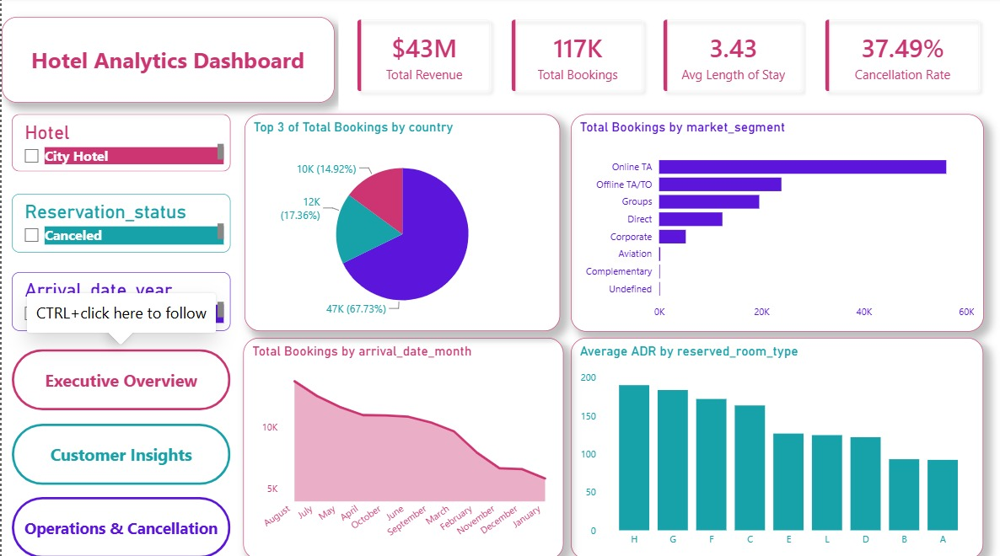
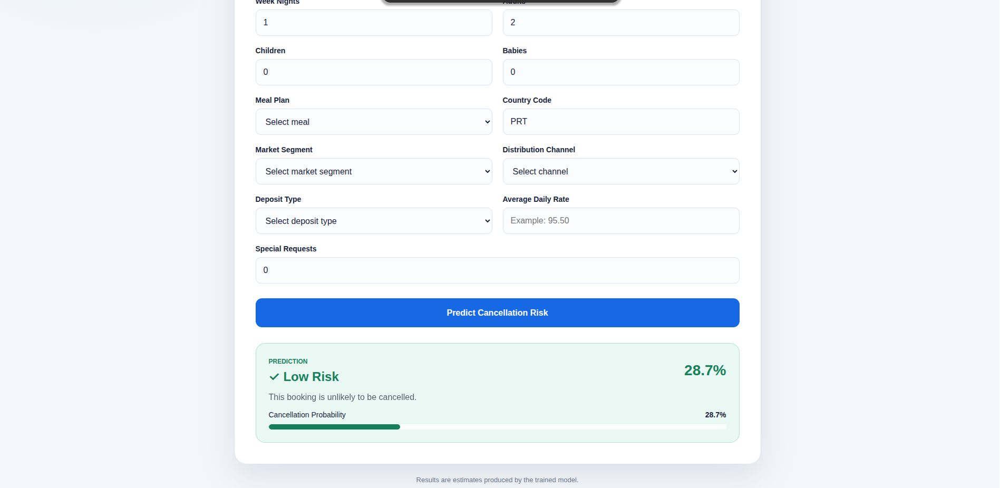

# 🏨 Hotel Booking Cancellation Prediction

A complete end-to-end Machine Learning project that predicts whether a hotel booking will be canceled before the arrival date.

The project covers the entire data science workflow, from data cleaning and exploratory analysis to feature engineering, model development, deployment using Flask, and containerization with Docker.

---

## 📸 Application Screenshots

## 🏠 Home Page

<p align="center">
  
</p>

## 🎯 Prediction Result

<p align="center">
  
</p>

# Project Overview

Hotel booking cancellations are a significant challenge for the hospitality industry. Canceled reservations lead to revenue loss, poor resource allocation, and inefficient hotel operations.

This project aims to build a predictive system capable of estimating the probability of booking cancellation using historical reservation data.

---

# Objectives

- Clean and preprocess real-world hotel booking data
- Perform Exploratory Data Analysis (EDA)
- Discover business insights
- Engineer meaningful features
- Train multiple Machine Learning models
- Compare model performance
- Deploy the best model as a web application
- Containerize the application using Docker

---

# Dataset

**Dataset Name**

Hotel Booking Demand Dataset

**Source**

Kaggle

The dataset contains approximately **120,000 hotel reservations** collected from both Resort Hotels and City Hotels.

### Features include

- Hotel Type
- Lead Time
- Arrival Date
- Number of Adults
- Number of Children
- Meal Type
- Country
- Market Segment
- Distribution Channel
- Deposit Type
- Booking Changes
- Previous Cancellations
- Customer Type
- Average Daily Rate (ADR)
- Special Requests
- Reservation Status

Target Variable

```
is_canceled
```

- 0 → Booking Not Cancelled
- 1 → Booking Cancelled

---

# Project Workflow

```
Raw Dataset
      │
      ▼
Data Cleaning
      │
      ▼
Exploratory Data Analysis
      │
      ▼
Feature Engineering
      │
      ▼
Preprocessing Pipeline
      │
      ▼
Model Training
      │
      ▼
Model Evaluation
      │
      ▼
Flask Web Application
      │
      ▼
Docker Deployment
```

---

# Data Cleaning

The following preprocessing steps were applied:

- Removed duplicated records
- Handled missing values
- Removed unnecessary columns
- Converted date columns to datetime
- Corrected data types
- Filled missing countries
- Filled missing agent IDs
- Created cleaner categorical values

---

# Feature Engineering

Additional features were created to improve model performance.

| Feature | Description |
|----------|-------------|
| total_nights | Weekend + Week Nights |
| family_size | Adults + Children + Babies |
| is_family | Whether the booking contains a family |
| has_previous_cancel | Customer canceled before |
| room_changed | Reserved room differs from assigned room |

---

# Exploratory Data Analysis

Several visualizations were created, including:

- Cancellation Rate
- Lead Time Distribution
- ADR Distribution
- Hotel Type Comparison
- Monthly Reservations
- Country Analysis
- Deposit Type Analysis
- Market Segment Analysis
- Correlation Heatmap
- Feature Importance

---

# Machine Learning

Three classification models were trained.

| Model | Purpose |
|---------|---------|
| Logistic Regression | Baseline Linear Model |
| Support Vector Machine (SVM) | Nonlinear Classification |
| Random Forest | Ensemble Learning |

---

# Data Preprocessing Pipeline

The preprocessing pipeline includes:

- One-Hot Encoding
- Standard Scaling (for required models)
- Random Forest Classifier

Implemented using:

- Pipeline
- ColumnTransformer

---

# Model Evaluation

Models were evaluated using:

- Accuracy
- Confusion Matrix
- Classification Report
- Precision
- Recall
- F1 Score

The **Random Forest Classifier** achieved the best overall performance and was selected for deployment.

---

# Web Application

A Flask web application was developed that allows users to:

- Enter booking information
- Predict cancellation risk
- Display prediction probability
- Show user-friendly results

---

# Docker

The application is fully containerized using Docker.

Build image

```bash
docker build -t hotel-booking-app .
```

Run container

```bash
docker run -p 5000:5000 hotel-booking-app
```

Open

```
http://localhost:5000
```

---

# Project Structure

```
hotel-booking-app/
│
├── app.py
├── Dockerfile
├── requirements.txt
├── README.md
├── cleaned_data.csv
├── Hotel_Booking.ipynb
│
├── templates/
│     └── index.html
│
├── static/
│     └── style.css
│
└── images/
```

---

# Technologies Used

- Python
- Pandas
- NumPy
- Matplotlib
- Seaborn
- Scikit-learn
- Flask
- HTML
- CSS
- Docker
- Git
- GitHub

---

# Installation

Clone the repository

```bash
git clone https://github.com/mo7amdSa3d/Hotel-Booking-Cancellation-Prediction.git
```

Navigate to the project

```bash
cd Hotel-Booking-Cancellation-Prediction
```

Install dependencies

```bash
pip install -r requirements.txt
```

Run the application

```bash
python app.py
```

---

# Future Improvements

Potential enhancements include:

- XGBoost implementation
- Hyperparameter optimization
- Explainable AI using SHAP
- Cloud deployment
- REST API
- User authentication
- Database integration
- CI/CD Pipeline

---

# Author

**Mohamed A.**

Data Science Student

Alexandria University

GitHub

https://github.com/mo7amdSa3d

---

# License

This project is intended for educational and research purposes.
